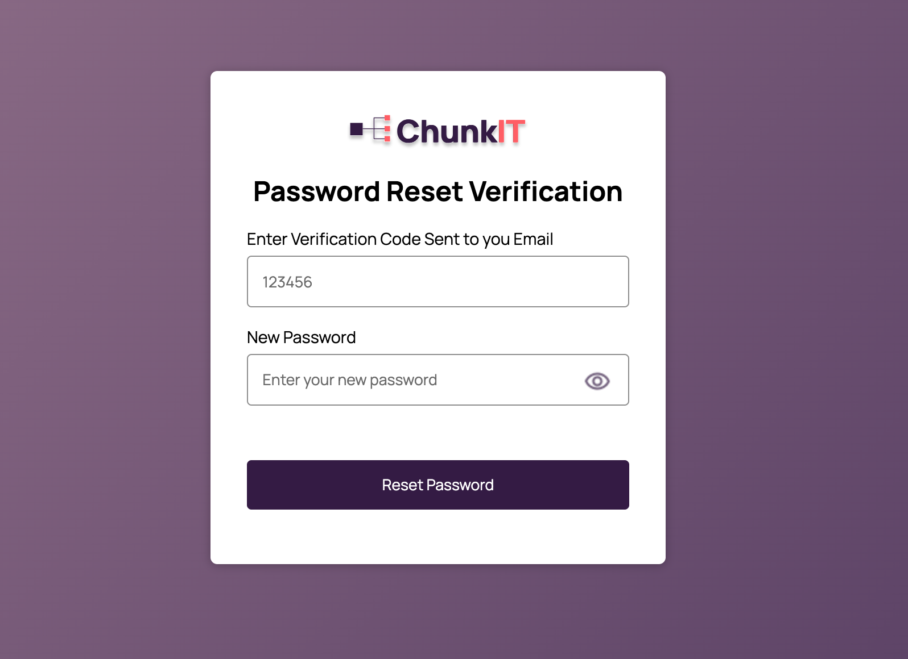

# file-server
Welcome to the File Server project! This document serves as a guide to understand the purpose, functionality, and implementation details of this project.

## Deployed Link & Admin Login Creadentials

| URL          | https://file.pythonanywhere.com/    |
| -------------| ------------------------------------|
| Admin Email  | admin@gmail.com                     |
| password     | 123                                 |

## Project Objective
The objective of the File Server project is to provide Lizzy's business with a digital platform for distributing various documents, such as wedding cards, admission forms, and more, to users remotely. By creating this platform, Lizzy aims to scale her business efficiently. The platform will allow users to easily access and download documents, streamlining the distribution process.

## Key Features
### For Users (Customers)
1. **User Registration**: New users can effortlessly register by providing necessary details (Email and Password).
2. **Account Verification**: After registering, users would be redirected to verification page they must verify their account by entering verification code sent to their email before they can be able to login.
3. **User Login**: Registered  users can securely log in to the platform using (Email and Password).
4. **Change Password**: Authenticated Users can change their password.
5. **Reset Password**: Users can reset their password when they can not remember
6. **Feed Page**: Authenticated users have access to a feed page where they can view a list of files available for download.
7. **Search Functionality**: Authenticated users can search for specific files within the file server.
8. **Send Files**: Authenticated Users can send files to an email address through the platform.
9. **Delete Account** User can delete his or her account


## For Admin
1. **File Management**: Admin have the capability to upload files to the server along with titles and descriptions.
2. **Delete Files**: Admin can delete file 
3. **Analytics**: Admin can view analytics such as the number of downloads and the number of emails sent for each file.

## Language and Framework
Python, 
Javascript,
Html,
css,
Django 
## Usage Guidelines
1. **Clone the Repository:**
   ```bash
   https://github.com/BINAH25/file-server.git
   cd file-server

2. **Create Virtual Environment:**
   ```bash
   python -m venv venv
   source venv/bin/activate  # On Windows, use `venv\Scripts\activate`

3. **Install the requires packages:**
   ```bash
   cd document_distribution
   pip install -r requirements.txt


4. **Run the following commands:**
   ```bash
   cd document_distribution
   pip install -r requirements.txt
   python manage.py makemigrations
   python manage.py migrate


5. **Create a Superuser by entering Email and Password:**
   ```bash
   python manage.py createsuperuser 

6. **Run the server:**
   ```bash
   python manage.py runserver

7. **Visit the url below to display the login page:**
   ```bash
   http://127.0.0.1:8000/


### Overview of the Pages
1. **Login Page**: The Image below show the login page used by both admins and customers. (admin must login with email and password used when creating the superuser) 

2. **Admin Dashboard**: the admin dashboard page shows the total number of downloads,email sent, files and users.Itl also displays the list of all the files uploaded with the download and email sent for each file. To add a new file click on the + button at the left corner


3. **User Registration Page**: New users can register by providing necessary details (Email and Password).

4. **User Verification Page**: users should enter the verification code sent to their email on this page. Below are the images of the verification page and email verification code


5. **User Dashboard Page**: the user dashboard page shows all the files uploaded the admins that the user can download and email.To download a file just click on the icon below the download File title or to email a file click on the icon below the title Email File.

6. **Email File Page**: Enter the email you wish to send to file to then click on email file 

7. **Search for a file**:To search for a file enter the file title or description or type in the search file then click on the search Button.

8. **Account Page**: Click on 'Account' the left corner of your dashboard below library to go to the account. On the account users can change change their password by entering their current password and the new one.To delete your account, click on the 'Delete Account' button located in the bottom right corner. A pop up modal will appear to confirm the deletion


9. **Reset Password Page**: click on the 'Reset Password' button on the login page then you will be redirected to the page below enter your email and a password verification will be sent to your email.

10. **Reset Password Code Verification Page**: Enter the verification code and your new password then click on "Reset Password" button


### API  VERSION DOCUMENTATION
the Above appllication using a monolithic architecture.
An api version of the above application is also available in this directory.

```
   document_distribution/rest_api
```
| API DOCUMENTATION URL| https://github.com/BINAH25/file-server/blob/main/document_distribution/Api_documentation.md|
| ---------------------|--------------------------------------------------------------------------------------------|

